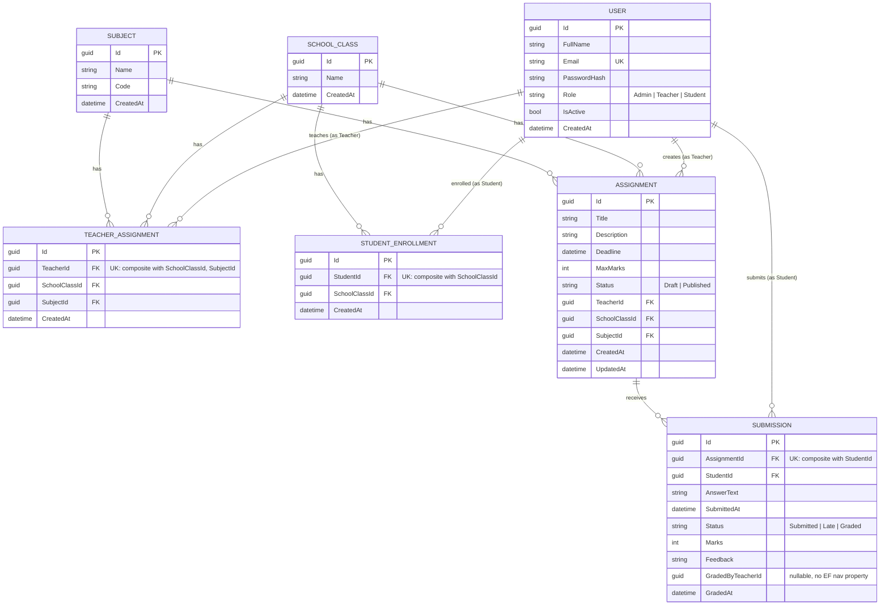

```mermaid
erDiagram
    USER ||--o{ TEACHER_ASSIGNMENT : "teaches (as Teacher)"
    USER ||--o{ STUDENT_ENROLLMENT : "enrolled (as Student)"
    USER ||--o{ ASSIGNMENT : "creates (as Teacher)"
    USER ||--o{ SUBMISSION : "submits (as Student)"

    SCHOOL_CLASS ||--o{ TEACHER_ASSIGNMENT : "has"
    SCHOOL_CLASS ||--o{ STUDENT_ENROLLMENT : "has"
    SCHOOL_CLASS ||--o{ ASSIGNMENT : "has"

    SUBJECT ||--o{ TEACHER_ASSIGNMENT : "has"
    SUBJECT ||--o{ ASSIGNMENT : "has"

    ASSIGNMENT ||--o{ SUBMISSION : "receives"

    USER {
        guid Id PK
        string FullName
        string Email UK
        string PasswordHash
        string Role "Admin | Teacher | Student"
        bool IsActive
        datetime CreatedAt
    }

    SCHOOL_CLASS {
        guid Id PK
        string Name
        datetime CreatedAt
    }

    SUBJECT {
        guid Id PK
        string Name
        string Code
        datetime CreatedAt
    }

    TEACHER_ASSIGNMENT {
        guid Id PK
        guid TeacherId FK "UK: composite with SchoolClassId, SubjectId"
        guid SchoolClassId FK
        guid SubjectId FK
        datetime CreatedAt
    }

    STUDENT_ENROLLMENT {
        guid Id PK
        guid StudentId FK "UK: composite with SchoolClassId"
        guid SchoolClassId FK
        datetime CreatedAt
    }

    ASSIGNMENT {
        guid Id PK
        string Title
        string Description
        datetime Deadline
        int MaxMarks
        string Status "Draft | Published"
        guid TeacherId FK
        guid SchoolClassId FK
        guid SubjectId FK
        datetime CreatedAt
        datetime UpdatedAt
    }

    SUBMISSION {
        guid Id PK
        guid AssignmentId FK "UK: composite with StudentId"
        guid StudentId FK
        string AnswerText
        datetime SubmittedAt
        string Status "Submitted | Late | Graded"
        int Marks
        string Feedback
        guid GradedByTeacherId "nullable, no EF nav property"
        datetime GradedAt
    }
```